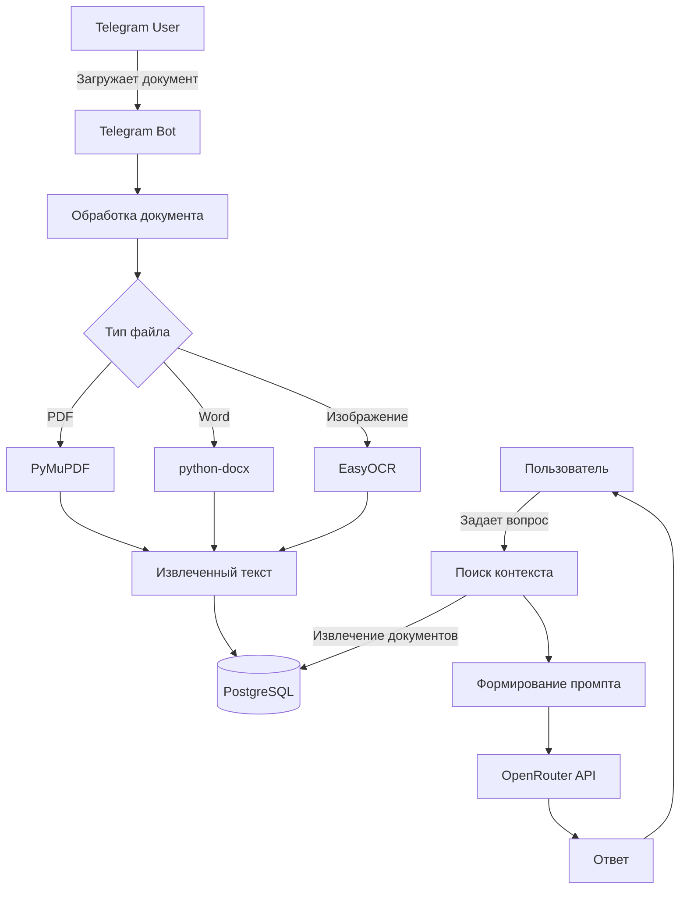

# 🤖 AI Document Assistant Bot

[](https://www.python.org/)
[](https://docs.aiogram.dev/)
[](https://www.postgresql.org/)
[](https://opensource.org/licenses/MIT)
[](https://openrouter.ai/)
[](https://github.com/JaidedAI/EasyOCR)

Telegram-бот для интеллектуального анализа документов на русском языке с использованием архитектуры **RAG (Retrieval-Augmented Generation)**. Бот позволяет загружать документы различных форматов и получать ответы на вопросы, строго основанные на содержании загруженных файлов.


## 🚀 Ключевые возможности

### 📄 Поддержка форматов
*   **PDF-документы**: Извлечение встроенного текста.
*   **Изображения (JPG/PNG)**: Распознавание текста с помощью OCR (**EasyOCR**).
*   **Word-документы (DOC/DOCX)**: Прямое извлечение текста.

### 🧠 Интеллектуальный анализ (RAG)
Бот не просто отвечает на вопросы, а действует по принципу RAG:
1.  **Поиск (Retrieval)**: При получении вопроса, бот обращается к базе данных и извлекает текст из всех документов пользователя.
2.  **Дополнение (Augmented)**: Текст документов вставляется в специальный промпт (инструкцию) для нейросети.
3.  **Генерация (Generation)**: Нейросеть (например, DeepSeek, Gemma, Mistral) генерирует ответ, основываясь **исключительно** на предоставленном контексте, что исключает "галлюцинации" и делает ответы фактологичными.

### 🖥️ Удобный интерфейс
*   Полностью интерактивное меню с кнопками, исключающее необходимость помнить команды.
*   Главное меню с разделами: загрузка, список документов, помощь, очистка истории.
*   Для каждого документа доступно персональное меню с действиями: показать текст, задать вопрос, удалить.

### 💾 Управление данными
*   **База данных PostgreSQL**: Надёжное хранение пользователей, всех документов и истории диалогов.
*   **Контекст диалога**: При вопросах по конкретному документу учитывается история общения по нему.
*   **Очистка данных**: Пользователь может удалить как всю историю переписки, так и отдельные документы (с каскадным удалением связанных сообщений).
*   **Автоматическая очистка**: Встроена функция для удаления старых временных файлов.

### ⏱️ Дополнительно
*   Корректное отображение времени загрузки (с учётом часового пояса Москвы UTC+3).
*   Безопасное отображение текста (экранирование HTML-символов).
*   Автоматический перебор доступных бесплатных AI-моделей через OpenRouter.


## 📋 Архитектура проекта



## 🚦 Установка и запуск

### Предварительные требования
* Python 3.13 или выше
* PostgreSQL 16 или выше
* Telegram Bot Token (от @BotFather)
* API ключ OpenRouter (от openrouter.ai)

### Пошаговая установка
```
1) Клонирование репозитория:
bash
git clone https://github.com/UnreadablePerson-wq/ai_doc_bot
cd ai_doc_bot

2) Создание виртуального окружения:
bash
python -m venv venv
#Для Windows:
venv\Scripts\activate
#Для Linux/Mac:
source venv/bin/activate

3) Установка зависимостей:
bash
pip install -r requirements.txt

4) Настройка базы данных PostgreSQL:
sql
CREATE DATABASE ai_doc_bot;
CREATE USER your_user WITH PASSWORD 'your_password';
GRANT ALL PRIVILEGES ON DATABASE ai_doc_bot TO your_user;

5) Создание файла .env :
#Telegram
TELEGRAM_TOKEN=your_telegram_bot_token
#OpenRouter
OPENROUTER_API_KEY=your_openrouter_api_key
#Database
DB_HOST=localhost
DB_PORT=5432
DB_NAME=ai_doc_bot
DB_USER=your_user
DB_PASSWORD=your_password

6) Запуск бота
bash
python -m bot.main
```

## 📁 Структура проекта

```
📦ai_doc_bot/
├── 📂bot/
│   ├── 📄__init__.py
│   ├── 📄main.py              # Точка входа
│   ├── 📄config.py             # Конфигурация
│   ├── 📄database.py           # Работа с БД
│   ├── 📄models.py             # Модели SQLAlchemy
│   ├── 📄ocr.py                # OCR обработка
│   ├── 📄openrouter_api.py     # OpenRouter API
│   └── 📂handlers/             # Обработчики команд
│       ├── 📄__init__.py
│       ├── 📄start.py          # /start и меню
│       ├── 📄commands.py       # Дополнительные команды
│       ├── 📄documents.py      # Загрузка документов
│       └── 📄chat.py           # Обработка вопросов
├── 📂temp/                      # Временные файлы
├── 📄.env                       # Переменные окружения
├── 📄requirements.txt           # Зависимости
├── 📄README.md                  # Документация
└── 📄LICENSE                    # Лицензия MIT
```

## 🤖 API и модели
Проект использует сервис OpenRouter.ai для получения доступа к большому пулу языковых моделей. Это позволяет:
1) Использовать бесплатные модели.
2) В случае недоступности одной модели автоматически переключаться на другую.
3) Не зависеть от одного провайдера.

Список приоритетных моделей:
1) openrouter/free - автоматический выбор доступной бесплатной модели
2) google/gemma-3-4b-it:free - легковесная модель от Google
3) google/gemma-3-12b-it:free - более мощная версия Gemma
4) qwen/qwen3-4b:free - модель от Alibaba
5) meta-llama/llama-3.2-3b-instruct:free - оптимизированная Llama от Meta

## 💡 Планы по развитию
Поддержка новых форматов.
Мультиязычность: Сделать интерфейс бота на английском языке.
Улучшение поиска: Внедрить векторный поиск (embeddings) для более точного нахождения релевантных фрагментов в больших документах.

## 📄 Лицензия
Проект распространяется под лицензией MIT. Подробности в файле LICENSE.

## 👨‍💻 Автор
GitHub: @UnreadablePerson-wq

Если этот проект показался вам интересным, не забудьте поставить звезду на GitHub! ⭐
